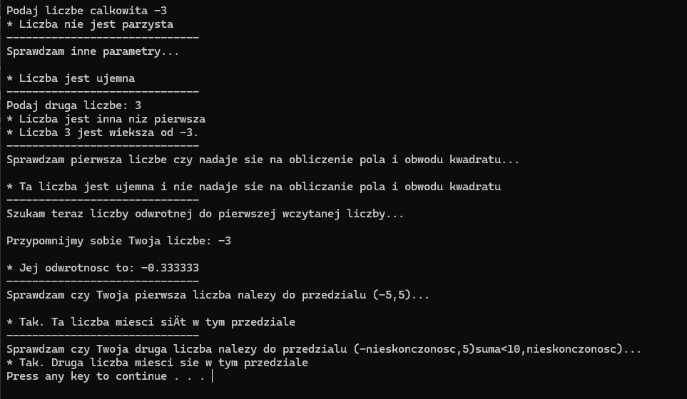

# C++ Learning and Practicing

Repozytorium zawiera moje ćwiczenia i projekty w języku C++, które wykonuję podczas nauki i praktyki programowania. Projekty obejmują zarówno podstawowe koncepcje, jak i bardziej zaawansowane zagadnienia, w tym obliczenia matematyczne, operacje na liczbach, prace z danymi wejściowymi/wyjściowymi oraz inne eksperymenty w C++.

## Projekty

### 1. [Podstawy](https://github.com/RoxanaGrzywacz/c--learning-and-practicing/tree/main/podstawy)
Jest to program skupiający się na wczytywaniu i drukowaniu danych. Wykonuje takie działania jak: 
- Podstawowe operacje matematyczne, takie jak dodawanie, odejmowanie, mnożenie i dzielenie.
- Obliczanie pola i obwodu różnych figur geometrycznych.
- Analiza liczb: sprawdzanie parzystości, dodatności i ujemności liczb, obsługa operacji na liczbach, takie jak odwrotności oraz porównywanie ich wartości.
- Sprawdzanie przynależności do przedziału.
- Operacje na liczbach zmiennoprzecinkowych.



## Technologie
- C++ (Standard C++11 i wyższy)
- Podstawy programowania: operatory, instrukcje warunkowe, pętle, funkcje
- Obsługa danych wejściowych i wyjściowych

## Kompilacja i uruchamianie
```bash
g++ -o nazwa_programu program.cpp
./nazwa_programu
```