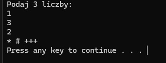

## podstawy-wczytywanie-wypisywanie

Jest to program skupiający się na wczytywaniu i drukowaniu danych. Wykonuje takie działania jak: 
- Podstawowe operacje matematyczne, takie jak dodawanie, odejmowanie, mnożenie i dzielenie.
- Obliczanie pola i obwodu różnych figur geometrycznych.
- Analiza liczb: sprawdzanie parzystości, dodatności i ujemności liczb, obsługa operacji na liczbach, takie jak odwrotności oraz porównywanie ich wartości.
- Sprawdzanie przynależności do przedziału.
- Operacje na liczbach zmiennoprzecinkowych.

## check-and-print oraz check-and-print-v2
Wypisywanie obliczeń w zależności od wartości liczb

Program prosi użytkownika o podanie trzech liczb całkowitych: a, b oraz c.

Następnie:
- Jeśli a == 1, wypisuje sumę b + c.
- Jeśli a == 3, wypisuje wartość c.
- Jeśli c jest parzyste, wypisuje wartość a.
- Jeśli c jest nieparzyste, wypisuje wynik dzielenia b / a (z przecinkiem).

Program check-and-print-v2 to bardziej zoptymalizowana wersja z flagą logiczną.

## check-and-print-with-flag

Sprawdzanie liczb i wypisywanie symboli

Program prosi użytkownika o podanie trzech liczb całkowitych.
Następnie sprawdza następujące warunki:
- Jeśli pierwsza liczba (a) jest równa 1, program wypisuje symbol "*".
- Jeśli druga liczba (b) jest równa 3, program wypisuje symbol "#".
- Jeśli trzecia liczba (c) jest mniejsza od 7, program wypisuje symbol "+++".

Program może wypisać kilka symboli naraz, jeśli spełnionych jest kilka warunków jednocześnie.
Jeśli żaden z powyższych warunków nie zostanie spełniony, program wypisuje komunikat:
"Nie podales liczb uruchamiajacych program".

Dzięki temu użytkownik od razu wie, które liczby uruchamiają określone części programu.
Na końcu program wstrzymuje zakończenie, aby użytkownik mógł zobaczyć wynik przed zamknięciem konsoli.

Założeniem tego ćwiczenia było przećwiczenie stosowania **flagi logicznej (bool wypisano)** do sprawdzania, czy którykolwiek z warunków został spełniony, co jest przydatne w kontrolowaniu przepływu programu i zachowaniu czytelności kodu.

## cmath-sqrt

Obliczanie wartości funkcji f(x) = √x

Program prosi użytkownika o podanie liczby x, a następnie oblicza pierwiastek kwadratowy z tej liczby:
- Jeśli x < 0, informuje użytkownika, że nie pierwiastkujemy liczb ujemnych.
- Jeśli x >= 0, oblicza √x i wypisuje wynik z dokładnością do dwóch miejsc po przecinku.

Program został napisany w celu przećwiczenia:
- użycia funkcji sqrt() z biblioteki <cmath>,
- formatowania wyniku za pomocą fixed i setprecision(),
- kontroli poprawności danych wejściowych.

## switch-case

Zamiana cyfry na słowo

Program prosi użytkownika o podanie jednej cyfry od 0 do 9,
a następnie wypisuje jej nazwę słowną, np.:
- dla 3 wypisze "trzy",
- dla 7 wypisze "siedem".

Jeśli użytkownik poda wartość spoza zakresu 0-9,
program informuje, że liczba jest nieprawidłowa.

Program został napisany w celu przećwiczenia stosowania instrukcji
**switch case** do wyboru działań w zależności od podanej wartości,
co ułatwia czytelność i organizację kodu przy wielu opcjach do obsłużenia.

